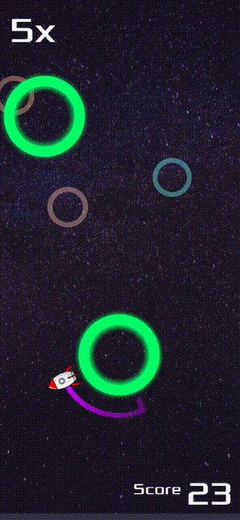
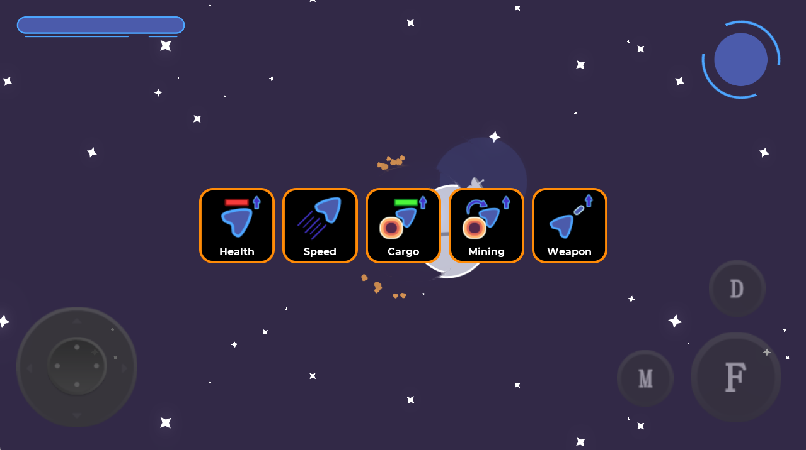
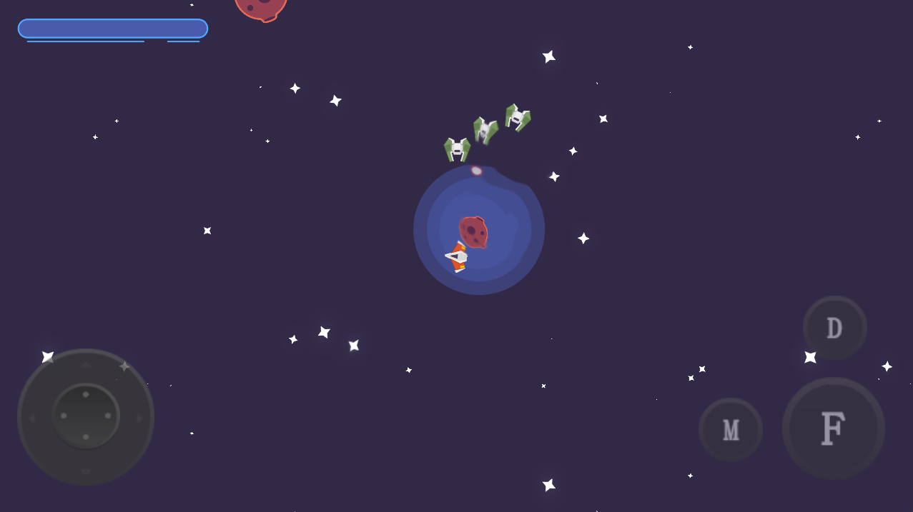

# Games made by Cadenza Yu

## Rocket Launch

Rocket Launch is an one-touch casual game.

Get it from [Google play store](https://play.google.com/store/apps/details?id=home.cadenzayu.rocketlaunch).

[HomePage](https://cadenzayu.github.io/rocket_launch).

[Privacy Policy](./rocket_launch_privacy_policy.html)

## TetrisBox

TetrisBox is a Classic tetis game for real fans

Get it from [Google play store](https://play.google.com/store/apps/details?id=home.cadenzayu.tetrisbox).

### Key Features:

- 120Hz refresh rate, smooth move
- Sensitive control, with almost the best control experience in the store
- Allows button hold, thumb friendly
- Sliding on the ground, ghost block, classic aftertaste

### Game story

In 1990, I owned my first game console--TetrisBox, which gave me a lot of happy times.

Now, it's too old to work anymore. I have tried many tetris-like APPs on the market, but have not found any satisfactory. So, I remake it for Android.

In this way, I can use my mobile to  revisit my good memories.

This APP was  developed for myself, and for real tetris fans also.

[Privacy Policy](./tetrisbox_privacy_policy.html).

## Harvester

Harvester is a Free and Open-Source top-down space mining game made with the Godot game engine. Control your spaceship in forays into an asteroid belt, gather iron, and bring it back to base. Spend them on upgrading your ship’s speed and maneuverability and cargo space.

But beware, as you are not alone out here. Pirate miners are out there and want to monopolize the business.

[HomePage](https://cadenzayu.github.io/Harvester).

[Privacy Policy](https://cadenzayu.github.io/Harvester/privacy.html).
